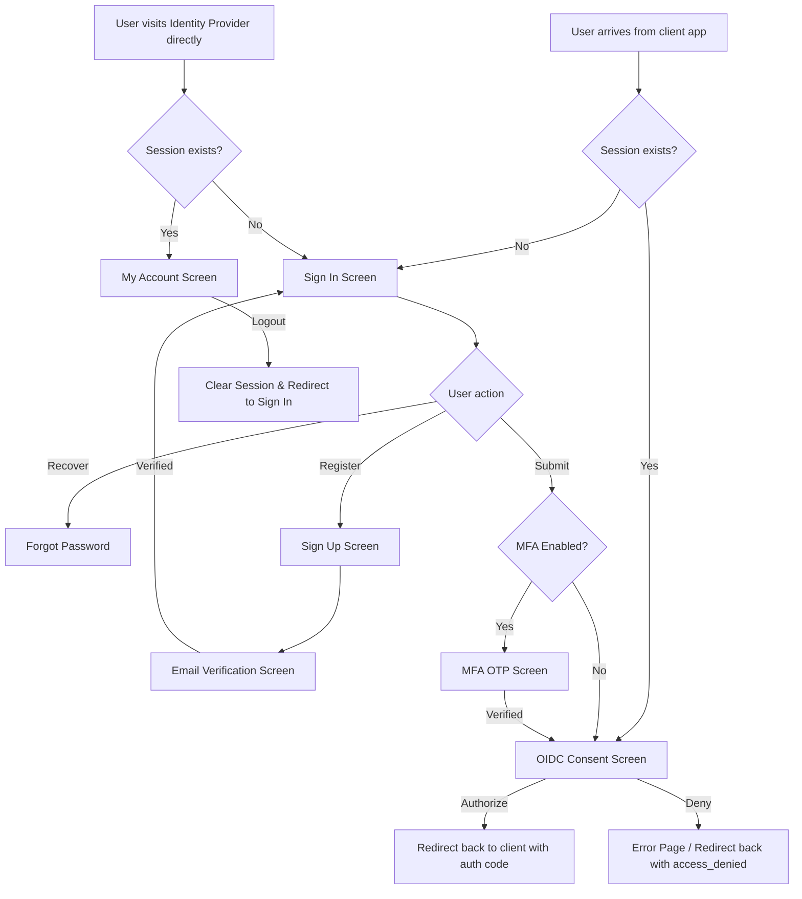

# yossid Frontend Screen Design Specification

This document defines the screen specifications, layout, visual tokens, and user flows for the **yossid** authentication frontend, based on the approved **Neo-Brutalist Bauhaus** design direction.

---

## 1. Visual Token System (Neo-Brutalist Bauhaus)

We use a high-contrast, structured aesthetic that emphasizes speed, transparency, and reliability.

| Token | Value | Description |
| :--- | :--- | :--- |
| **Background** | `#FAF9F6` | Alabaster Warm White |
| **Card Fill** | `#FFFFFF` | Pure White |
| **Ink Black** | `#111111` | Primary text, borders, and hard drop shadows |
| **Borders** | `4px solid #111111` | Thick borders for cards, buttons, and focused fields |
| **Shadow Offset** | `6px 6px 0px #111111` | 90-degree flat offset shadows |
| **Accent Color** | `#2563EB` | Cobalt Blue (used for primary actions/links) |
| **Accent Hover** | `#1D4ED8` | Deep Cobalt Blue |
| **Display Font** | `Space Grotesk` | Clean geometric sans-serif for headings |
| **Body/Utility Font**| `JetBrains Mono` | High-readability monospace for inputs, data, and metadata |

---

## 2. Screen Catalogue

### 2.1 Sign In Screen (`/login`)
The main gateway for returning users. This screen dynamically adapts based on the entry context (RP-initiated vs. Direct).

#### A. Context-Aware Header & Subtitle
- **OIDC Flow (via RP)**:
  - Subtitle renders dynamically: `> AUTHENTICATION FOR [Client App Name]` (e.g., retrieving the client metadata/application name from the active OIDC request context).
  - A subtle metadata tag is displayed: `FLOW: OIDC_AUTHORIZATION`.
- **Direct Access (Direct visit to yossid)**:
  - Subtitle renders: `> AUTHENTICATION FOR YOSSID ACCOUNTS`.
  - Metadata tag is displayed: `FLOW: DIRECT_ACCESS`.

#### B. Post-Login Routing Logic
- **OIDC Flow (via RP)**:
  - After successful authentication (and MFA if enabled), the user is routed to the **Consent Screen (`/consent`)** to approve requested scopes, and then redirected back to the RP redirect URI.
- **Direct Access**:
  - After successful authentication, the user is routed directly to their **My Account Home Screen (`/account`)**.

- **Header**: `yossid` logo (lowercase, underlined in cobalt).
- **Form Fields**:
  - `Email`: `type="email"`, `autocomplete="username"`, `required`, placeholder `name@domain.com`.
  - `Password`: `type="password"`, `autocomplete="current-password"`, `required`, with a `[SHOW]/[HIDE]` custom monospace toggle button.
- **Helper Links**: `RECOVER` (forgot password link, aligned right next to password label).
- **Primary Action**: `SIGN_IN_SECURELY` button (cobalt fill, thick border, flat shadow).
- **Footer**: `NEW_USER? [CREATE_ACCOUNT]` link pointing to `/register`.

### 2.2 Sign Up / Registration Screen (`/register`)
For creating new user profiles.
- **Header**: `yossid` logo, subtitle `> CREATE_NEW_IDENTITY`.
- **Form Fields**:
  - `Email`: `type="email"`, `autocomplete="email"`, `required`, placeholder `your.email@domain.com`.
  - `Password`: `type="password"`, `autocomplete="new-password"`, `required`.
  - `Confirm Password`: `type="password"`, `autocomplete="new-password"`, `required`.
  - `Full Name`: `type="text"`, `autocomplete="name"`, `required`, placeholder `Taro Yamada` (for profile claim).
  - `Katakana Name`: `type="text"`, `required`, placeholder `ヤマダ タロウ` (validated using client-side Katakana regex `^[ァ-ヶー\s]+$`).
  - `Birthdate`: `type="date"`, `required` (for profile claim).
  - `Gender`: `<select>` input containing: `Male`, `Female`, `Other`, `Prefer not to say`.
- **Primary Action**: `CREATE_IDENTITY` button.
- **Footer**: `EXISTING_USER? [SIGN_IN]` link pointing to `/login`.

### 2.3 Email Verification Waiting Screen (`/email/verify`)
Displayed after registration or when the email is not yet verified.
- **Status Header**: `yossid_verification` logo, metadata tag `STATUS: PENDING_VERIFICATION`.
- **Description**: Monospace text explaining that a confirmation email was sent to the user's email address.
- **Form Fields**:
  - `Verification Token`: `type="text"`, `required`, `inputmode="text"`, placeholder `Enter verification token` (for users who manually copy-paste the token from their email instead of clicking the link).
- **Actions**:
  - `VERIFY_TOKEN` button.
  - `RESEND_VERIFICATION_EMAIL` link.

### 2.4 MFA OTP Entry Screen (`/mfa`)
For entering the 2-factor authentication code during sign-in.
- **Header**: `yossid_auth` logo, metadata tag `MFA_CHALLENGE_REQUIRED`.
- **Description**: Monospace instructions: `Enter the 6-digit verification code sent to your email.`
- **Form Fields**:
  - `OTP Code`: `type="text"`, `required`, `inputmode="numeric"`, `pattern="[0-9]{6}"`, `autocomplete="one-time-code"`, placeholder `000000`.
- **Primary Action**: `CONFIRM_CODE` button.
- **Helper Links**: `RESEND_CODE` link.

### 2.5 OIDC Consent Screen (`/consent`)
Displayed when a client application (e.g., `client-app`) requests user authentication and scopes.
- **Header**: `yossid_consent` logo, metadata tag `SCOPE_AUTHORIZATION`.
- **Request Title**: `client-app is requesting access to your identity`
- **Scope list**:
  - `openid` ➔ Unique identifier for your account
  - `email` ➔ Email address and verification status
  - `profile` ➔ Full Name, Katakana Name, Birthdate, and Gender
- **Actions (Side-by-side)**:
  - `AUTHORIZE_ACCESS` button (Cobalt fill, right side).
  - `DENY_ACCESS` button (Outline border only, left side).

### 2.6 Error / Status Screen (`/error`)
Unified screen for displaying system or OIDC protocol errors.
- **Header**: `yossid_error` logo, metadata tag `SYSTEM_ALERT`.
- **Error Details**: A styled monospace console code block displaying:
  ```text
  ERROR_CODE: oauth2_invalid_request
  DETAILS: The request is missing a required parameter: redirect_uri
  ```
- **Primary Action**: `RETURN_TO_SAFETY` button.

### 2.7 My Account Home Screen (`/account`)
The dashboard landing page for authenticated users. Provides a high-level summary and links to sections.
- **Navigation Bar**: Logo and `Sign Out` button.
- **Sidebar (Left on desktop, Top tab-row on mobile)**: Links to `Home` (`/account`), `Personal Info` (`/account/profile`), and `Security` (`/account/security`).
- **Portal Summary Cards**:
  - `Personal Info Summary`: Lists current Name, Email, and Gender with a `Manage Profile` button.
  - `Security Summary`: Displays current MFA status (`MFA_ENABLED`) with a `Manage Security` button.

### 2.8 My Account Personal Info Screen (`/account/profile`)
Dedicated page for users to view and update their profile details.
- **Fields**:
  - `Email Address`: Displays current email, input disabled (non-editable).
  - `Full Name`: Text input (pre-populated with `Jane Doe`).
  - `Katakana Name`: Text input (pre-populated with `ジェーン ドゥ`, validated with Katakana regex).
  - `Birthdate`: Date input (pre-populated with birthdate).
  - `Gender`: Dropdown menu selector.
- **Primary Action**: `Save Changes` button.

### 2.9 My Account Security Screen (`/account/security`)
Dedicated page for managing credential security, MFA settings, and active session tokens.
- **2-Step Verification Card**: Displays active status with a `Disable 2-Step Verification` toggle button.
- **Change Password Card**: Form fields for `Current Password`, `New Password`, and `Confirm New Password` with an `Update Password` button.
- **Active Devices Card**: Table/List displaying all active session tokens with IP, Device Name, Location, and `Revoke` buttons next to foreign sessions.

---

## 3. Key User Flows & Transitions


